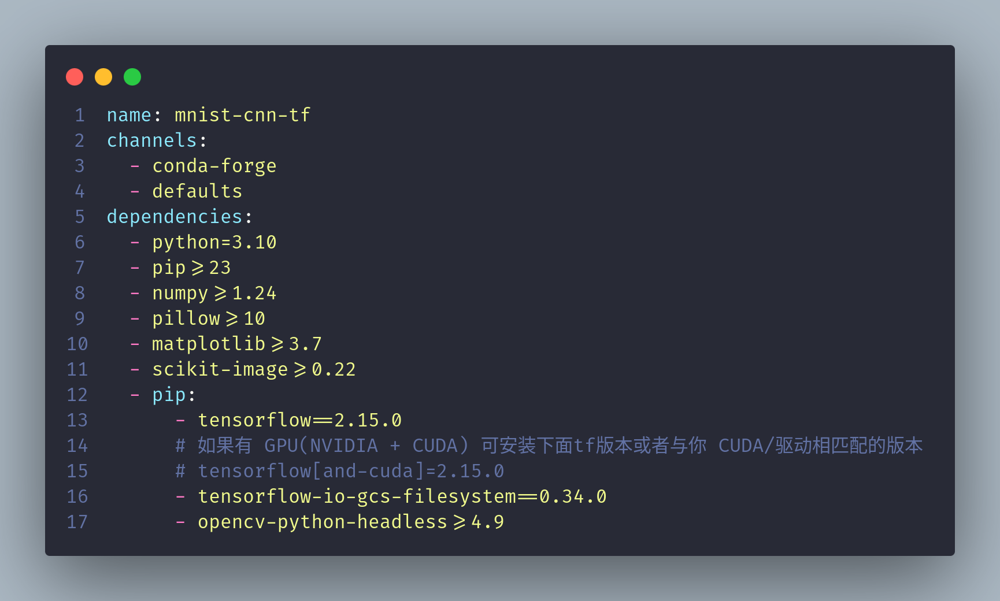
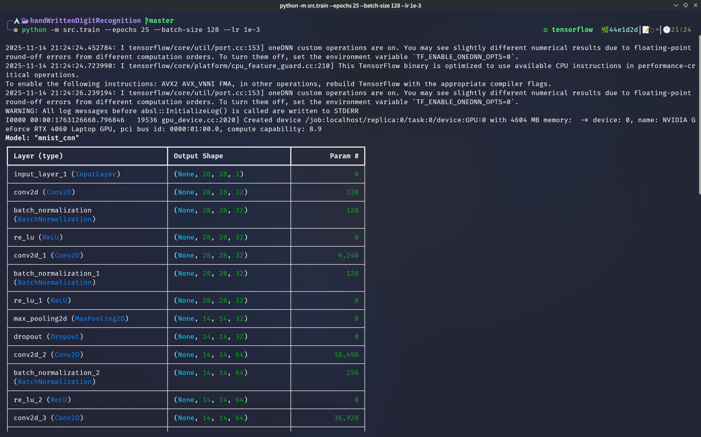
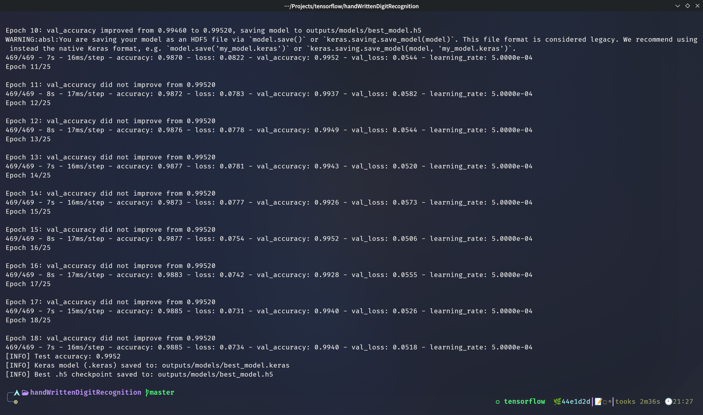
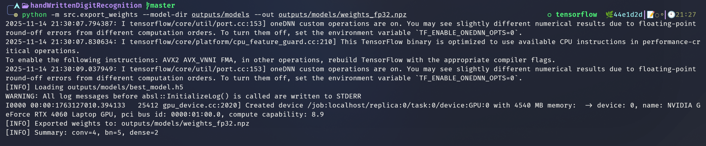
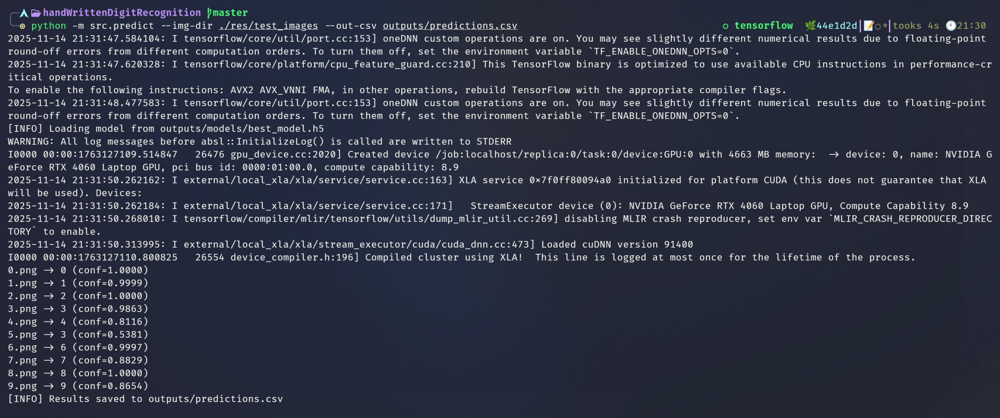
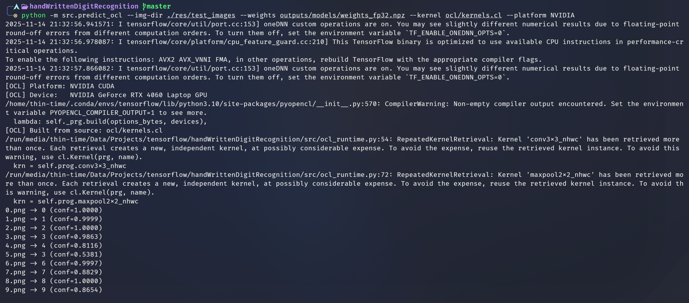
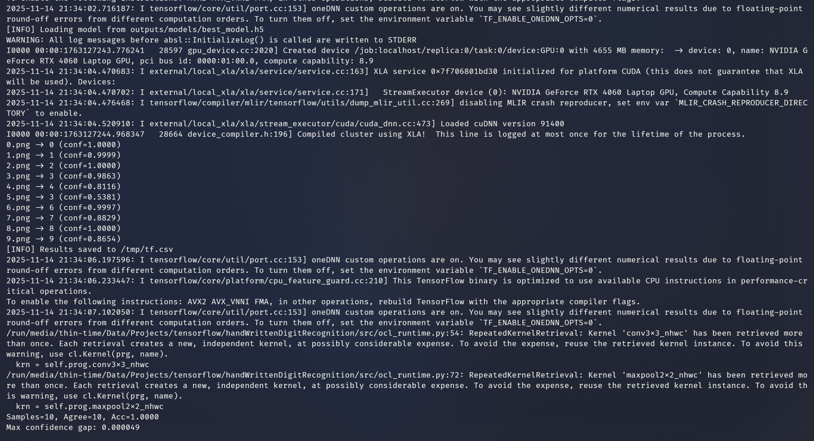

# MNIST 手写数字识别（TensorFlow + OpenCL）

## 前言

本项目使用 TensorFlow 构建与训练卷积神经网络识别 MNIST 手写数字，并提供了基于 OpenCL/FPGA 的推理路径，能实现使用 tensorflow 和 OpenCL 两种方式（会自动选择是否进行GPU版本运行）进行对本地目录下的所有手写数字图片进行识别，并且进行置信度对比。

报告内容包括：部署步骤（环境配置与运行步骤）、项目结构说明、实现原理解释以及AI使用说明。

## 环境准备

### 先前说明

我的实验环境介绍：

- 实验操作系统为archlinux
- 使用 `anaconda`创建`conda`虚拟环境管理项目相关环境依赖，使用`conda`和`pip`下载和管理需要的`tensorflow`、`opencv`以及其他相关依赖。
- 不需要手动下载 MNIST 数据集，因为在源码中会自动从网络拉取。
- 使用CUDA驱动与 GPU版本进行构建与训练模型，因为效率可以得到明显提高
- 对于`opencl`环境的配置，只需要`sudo pacman -S opencl-nvidia`将NVIDIA版的`opencl`相关依赖下载到本机。

### 创建并激活环境

在`env/environment.yml`中指定了运行本项目需要的所有依赖，可以使用以下命令一键创建虚拟环境安装依赖并激活虚拟环境。

```bash
conda env create -f env/environment.yml
conda activate mnist-cnn-tf
```



### 判断是否检测到GPU

如果具备GPU,可以使用以下命令快速自检，判断是否具备完整依赖（GPU版本）。

```
python -c "import tensorflow as tf; print(tf.__version__); print('GPU:', tf.config.list_physical_devices('GPU'))"
```

若成功输出版本号且列出 GPU，则说明 TensorFlow 工作正常；否则将自动落到 CPU。

## 项目结构
```
.
├── env/
│   └── environment.yml        # Conda 环境定义
├── src/
│   ├── train.py               # 训练入口，包含 CLI 参数解析
│   ├── predict_ocl.py         # OpenCL 推理入口（CPU/GPU/FPGA）
│   ├── export_weights.py      # 导出权重为 NPZ，供 OCL 管线使用
│   ├── ocl_runtime.py         # OpenCL 内核封装与运行时
│   ├── fold_bn.py             # BN 融合工具（可选）
│   ├── data.py                # MNIST 下载、预处理与增强
│   └── utils.py               # 公共工具函数
├── models/
│   └── cnn.py                 # CNN 架构定义
├── ocl/
│   ├── kernels.cl             # OpenCL 核函数（卷积/池化等）
│   └── README.md              # OCL 内核和部署说明
├── res/
│   └── test_images/           # 示例手写数字
├── outputs/                   # 训练与推理生成的产物
│   ├── logs/                  # TensorBoard 日志
│   └── models/                # 导出的 best_model.h5/.keras/.npz
├── tests/
│   └── compare_ocl_vs_tf.py   # 对比 OCL 与 TF 推理结果
└── README.md
```

## 运行流程

下面是对结果复现的步骤说明

1. **装好环境**  
   上面已经进行说明

2. **先训练一版模型**  
   ```bash
   python -m src.train --epochs 25 --batch-size 128 --lr 1e-3
   ```
   - 会自动下载 MNIST，并把日志写到 `outputs/logs/`。
   - 回调配置好了 EarlyStopping、ReduceLROnPlateau、ModelCheckpoint、TensorBoard。
   - 训练结束会在控制台打印测试集准确率，并在 `outputs/models/` 留下 `best_model.h5` 和 `best_model.keras`。
   - 想调试可用 `--no-augment` 关掉数据增强，或用 `--seed` 固定随机数。
   
   

3. **把权重导出给 OpenCL/FPGA 用**  
   ```bash
   python -m src.export_weights --model-dir outputs/models --out outputs/models/weights_fp32.npz
   ```
   会把卷积核排布和 BN 参数整理好，存成 `weights_fp32.npz`。
   

4. **用 TensorFlow 批量预测**  
   
   ```bash
   python -m src.predict --model-dir outputs/models --img-dir res/test_images --out-csv outputs/predictions.csv
   ```
   支持常见图片格式，终端会打印类别和置信度，也可以用 `--out-csv` 存结果。
   
   
5. **换成 OpenCL 跑一遍（CPU/GPU/FPGA 都行）**  
   ```bash
   python -m src.predict_ocl \
       --img-dir res/test_images \
       --weights outputs/models/weights_fp32.npz \
       --kernel ocl/kernels.cl \
       --platform NVIDIA \
       --device GeForce
   ```
   `--platform`/`--device` 选具体硬件；如果是 FPGA，可以按 `docs/fpga_deployment_guide.md` 的说明传入编译好的 `.aocx` 或 `.xclbin`。
   

6. **两套链路一致性对比**  
   ```bash
   python tests/compare_ocl_vs_tf.py res/test_images
   ```
   它会分别跑 TensorFlow 和 OpenCL，然后对比一致率。
   

## 数据与输出说明
- MNIST 会自动下载到 `~/.keras/datasets/`，不用手动找数据。
- 训练、日志、预测结果都在 `outputs/`，想重新跑可以先清掉这个目录。
- `res/` 里有示例图片，也可以放自己写的 28×28 灰度图进去测试。

## 具体实现原理

这部分是我做本实验时的一些关键的思路整理

### 数据预处理与输入管线

- `src/data.py` 用 `tf.keras.datasets.mnist` 拉 28×28 的灰度图，然后在 `src/utils.normalize_img` 里把像素归一化到 `[0,1]`，并补上通道维。
- 训练默认开了轻量数据增强：随机平移、旋转、缩放，想更快可以用 `--no-augment` 关掉。
- `tf.data.Dataset` 里做了 `shuffle → map → batch → prefetch`，保证训练时的吞吐。

### 卷积神经网络结构

- `models/cnn.py` 里是两段卷积块：每段有两层 `Conv2D(3×3)` + `BatchNormalization` + `ReLU`，再接 `MaxPooling(2×2)` 和递增的 `Dropout`，在 MNIST 上能做到测试错误率 <1%。
- 全连接部分是 `Flatten → Dense(128)`，配上 BN 和 Dropout，最后 `Dense(10, softmax)`；所有可训练层加了 L2（1e-4）。
- `src/train.py` 用 Adam（1e-3），配合 EarlyStopping、ReduceLROnPlateau、ModelCheckpoint、TensorBoard，默认训 25 轮、batch 128。

### 权重导出与 BN 融合

- `src/export_weights.py` 会把 Keras 的卷积核 `(Kh, Kw, Cin, Cout)` 转成 `(Cout, Kh, Kw, Cin)`，再连同 BN 参数一起存到 `weights_fp32.npz`。
- 如果想少占点推理算子，可以跑 `src/fold_bn.py` 把 BN 融进卷积/全连接，得到 `weights_fused.npz`。

### OpenCL 推理链路

- `src/ocl_runtime.py` 负责选平台/设备并编译 `ocl/kernels.cl`，主机侧做 BN 和 ReLU，简化内核方便以后做定点化。
- `src/predict_ocl.py` 会加载 `weights_fp32.npz`，再把图片反色、居中、缩放到 NHWC 格式，按“卷积块 → 池化 → 全连接 → Softmax”手动前向，和 TensorFlow 对齐。
- OpenCL 内核是逐像素展开写的，优先保证跨设备都能跑；FPGA 可以用预编译的 `.aocx/.xclbin`。

## 利用 AI 探索的过程
- 在搭网络前，先让大模型帮我整理了一版“最小可行”训练思路：保留两段卷积块、适度 Dropout、轻量数据增强，保证首次跑通能稳定收敛。
- 确定基础版后，再请它罗列 3~4 组可验证的超参数方向（学习率、Batch 大小、是否关增强、Dropout 取值），我按顺序在本地跑少量 Epoch，看收敛速度与稳定性，不做大规模网格搜索。
- OpenCL 调试时遇到 shape/stride 不一致，把日志和内核片段抛给助手检查维度顺序，对齐了 NHWC→NCHW 的转换和 padding 细节，避免了盲查。
- 导出权重给 OCL 时有排布存疑，于是让大模型给出卷积核和 BN 参数的保存格式确认，再对照 `weights_fp32.npz` 做了一次 spot check，确保后端前向与 TF 一致。
